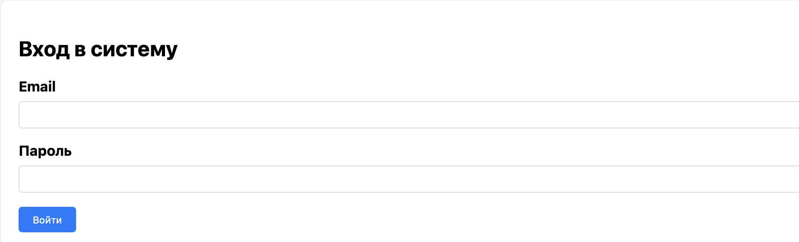
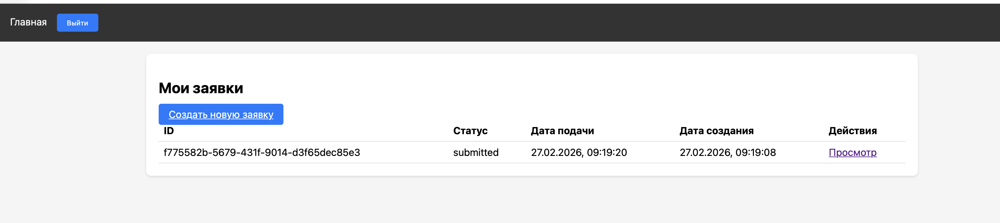
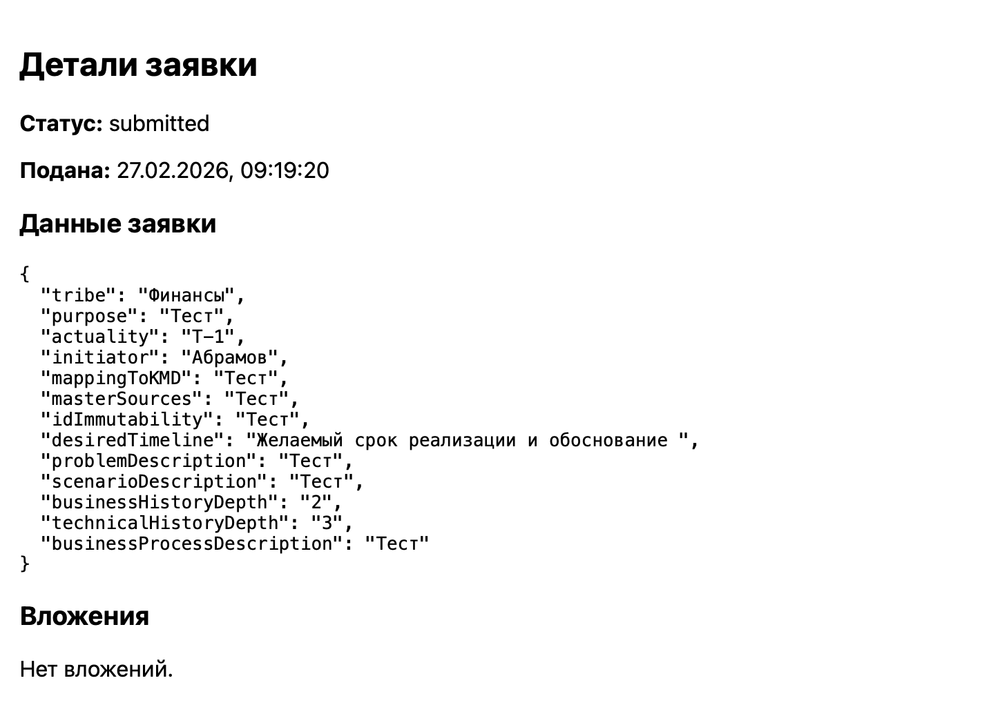

# IDS Application Service / Сервис ИНД заявок

This project provides a web‑based service for managing IDS applications. It allows users to create, submit, and track applications with flexible forms, attach files, and receive status updates. Administrators can review applications, change statuses, and leave comments. The application is built to be easily deployable on‑premises using Docker.

## User Workflow

This section describes the typical steps a user follows to register, fill out an application, and track its status.

### 1. Registration

- Open the application in your browser (`http://localhost`).
- Click **Регистрация** (Register) in the navigation bar.
- Fill in the registration form:
  - **Email** – a valid email address.
  - **Пароль** (Password) – at least 6 characters.
  - **Имя** (First name)
  - **Фамилия** (Last name)
- Click **Зарегистрироваться** (Register).  
  If successful, you will be redirected to the login page.


### 2. Login

- On the login page, enter your **Email** and **Пароль**.
- Click **Войти** (Login).  
  After successful authentication, you are redirected to your personal dashboard – **Мои заявки** (My Applications).

  

### 3. Dashboard – My Applications

- The dashboard lists all applications you have created, showing:
  - **ID** – unique identifier.
  - **Статус** (Status) – e.g., draft, submitted, under review, accepted, rejected.
  - **Дата подачи** (Submission date) – filled only after submission.
  - **Дата создания** (Creation date).
  - **Действия** (Actions) – a link to view the application details.
- To start a new application, click the **Создать новую заявку** (Create New Application) button.

 

### 4. Create a New Application

- You are presented with a form whose fields are defined by the system administrator (based on the template's "Интегрированный набор данных" sheet).  
  Typical fields may include:
  - Описание сценария (text area)
  - Маппинг на имеющийся набор данных (text area)
  - Набор мастер-источников (text)
  - Глубина бизнес-истории (text)
  - Актуальность (dropdown with predefined values)
  - Желаемый срок реализации и обоснование (date picker)
  - and others, depending on configuration.
- Fill in all required fields (marked with `*`).
- Click **Создать черновик** (Create Draft).  
  The application is saved with status **draft**, and you are redirected to its detail page.

 

### 5. Add Attachments (Optional)

- On the application detail page, scroll to the **Вложения** (Attachments) section.
- Click **Выберите файл** (Choose file), select a document (PDF, image, Word, etc.), then click **Загрузить** (Upload).  
  The file is stored on‑premises, and its name appears in the attachment list.
- You can upload multiple files while the application is still in draft status.

### 6. Submit the Application

- When you have finished filling out the form and uploading all necessary files, click the **Отправить заявку** (Submit Application) button.
- The status changes to **submitted**.  
  If email notifications are configured, you will receive a confirmation email.
- Once submitted, you can no longer edit the form or upload new files (unless the admin changes it back to draft).

 

### 7. Track Application Status

- Return to the dashboard (**Мои заявки**) to see the updated status.
- Statuses can be:
  - **draft** – not yet submitted.
  - **submitted** – awaiting review.
  - **under_review** – being examined by an administrator.
  - **accepted** – approved.
  - **rejected** – declined (with possible comment).
- Click on any application to view its details, including the data you entered and any comments left by the administrator.

### 8. Administrator Actions (for reference)

Administrators have additional capabilities:
- View all applications (from all users) via the **Админ панель** (Admin Dashboard).
- Change the status of any application and leave a comment.
- Manage the metadata configuration of the integrated dataset via the **Настройка набора данных** (Dataset Config) page.

This workflow covers the complete user journey from registration to final decision.


## Features

- User registration and authentication (JWT).
- Dynamic application forms configured via a simple JavaScript file (fields based on the "Интегрированный набор данных" template).
- File uploads (resumes, documents) stored on‑premises.
- User dashboard to list, view, and submit applications.
- Admin dashboard to view all applications and update their status.
- Admin interface to manage dataset metadata (according to the provided Excel template).
- Russian language interface (can be switched to English by modifying the code).
- Fully containerised with Docker and Docker Compose.

## Technology Stack

- **Backend:** Node.js + Express (TypeScript)
- **Database:** PostgreSQL (with JSONB for flexible application data)
- **Frontend:** React (bootstrapped with Create React App)
- **Reverse Proxy:** Nginx (serves frontend and proxies API requests)
- **File Storage:** Local on‑premises directory (mounted into containers)
- **Containerisation:** Docker, Docker Compose

## Prerequisites

- [Docker](https://www.docker.com/products/docker-desktop) (version 20.10+)
- [Docker Compose](https://docs.docker.com/compose/) (usually included with Docker Desktop)
- [Git](https://git-scm.com/) (optional, for cloning)

## Getting Started

### 1. Clone the repository

```bash
git clone https://github.com/your-username/user-app-service.git
cd user-app-service
```

### 2. Create environment configuration

Copy the example environment file and adjust values as needed:

```bash
cp .env.example .env
```

Edit `.env` with your preferred database credentials, JWT secret, and SMTP settings (if you want email notifications).  
**Important:** Keep this file secure and never commit it.

### 3. Build and start the containers

```bash
docker-compose build
docker-compose up -d
```

This will build the Node.js backend image and start three containers:
- `app-db` – PostgreSQL database
- `app-node` – Node.js backend
- `app-nginx` – Nginx web server

### 4. Initialize the database schema

The database tables need to be created. Run:

```bash
docker exec -it app-db psql -U appuser -d appdb
```

Then execute the following SQL (you can also run it from a file):

```sql
CREATE EXTENSION IF NOT EXISTS "uuid-ossp";

CREATE TABLE users (
    id UUID PRIMARY KEY DEFAULT uuid_generate_v4(),
    email TEXT UNIQUE NOT NULL,
    password_hash TEXT NOT NULL,
    role TEXT DEFAULT 'user',
    created_at TIMESTAMP DEFAULT NOW()
);

CREATE TABLE profiles (
    user_id UUID REFERENCES users(id) ON DELETE CASCADE,
    first_name TEXT,
    last_name TEXT,
    phone TEXT
);

CREATE TABLE applications (
    id UUID PRIMARY KEY DEFAULT uuid_generate_v4(),
    user_id UUID REFERENCES users(id) ON DELETE CASCADE,
    status TEXT NOT NULL,
    submitted_at TIMESTAMP,
    data JSONB,
    created_at TIMESTAMP DEFAULT NOW(),
    updated_at TIMESTAMP DEFAULT NOW()
);

CREATE TABLE attachments (
    id UUID PRIMARY KEY DEFAULT uuid_generate_v4(),
    application_id UUID REFERENCES applications(id) ON DELETE CASCADE,
    filename TEXT NOT NULL,
    file_path TEXT NOT NULL,
    uploaded_at TIMESTAMP DEFAULT NOW()
);

CREATE TABLE reviews (
    id UUID PRIMARY KEY DEFAULT uuid_generate_v4(),
    application_id UUID REFERENCES applications(id) ON DELETE CASCADE,
    admin_id UUID REFERENCES users(id),
    comment TEXT,
    new_status TEXT,
    created_at TIMESTAMP DEFAULT NOW()
);

-- Insert a default admin user (password: "password")
INSERT INTO users (email, password_hash, role) VALUES (
    'admin@example.com',
    '$2b$10$eL9yI6qX3Fz5sVtZzLZQK.6bJqyX0Fz5sVtZzLZQK.6bJqyX0Fz5s',
    'admin'
);
\q
```

> **Note:** The bcrypt hash above corresponds to the string `"password"`. You should change it after first login.

### 5. Build the frontend

The frontend source is in the `frontend/` folder. To create the production build, run:

```bash
cd frontend
npm install
npm run build
```

If you don’t have Node.js installed locally, you can use Docker:

```bash
cd ~/user-app-service
docker run --rm -v $(pwd)/frontend:/app -w /app node:18-alpine sh -c "npm install && npm run build"
```

The built files will be placed in `frontend/build` and served automatically by Nginx.

### 6. Access the application

Open your browser and go to `http://localhost`. You should see the login page.

- Register a new user or log in with `admin@example.com` / `password`.
- The admin user has access to additional panels: **Админ панель** and **Настройка набора данных**.

## Project Structure

```
.
├── backend/                # Node.js backend source
│   ├── src/
│   │   ├── config/         # Environment and DB config
│   │   ├── controllers/    # Route controllers
│   │   ├── middleware/     # Auth, validation, error handling
│   │   ├── models/         # Database queries (optional)
│   │   ├── routes/         # Express routes
│   │   ├── services/       # Email, file handling
│   │   ├── utils/          # Logger, validation schemas
│   │   └── index.ts        # Entry point
│   ├── Dockerfile
│   └── package.json
├── frontend/               # React frontend
│   ├── public/
│   ├── src/
│   │   ├── components/     # React components
│   │   ├── api.js          # Axios API client
│   │   ├── App.js
│   │   ├── formConfig.js   # Application form field definitions
│   │   └── ...
│   └── package.json
├── nginx/
│   └── default.conf        # Nginx configuration
├── uploads/                # On‑premises file storage (created at runtime)
├── docker-compose.yml
├── .env.example            # Example environment variables
└── README.md
```

## Environment Variables

The following variables are required in `.env`:

| Variable          | Description                               | Example                 |
|-------------------|-------------------------------------------|-------------------------|
| DB_USER           | PostgreSQL user                           | appuser                 |
| DB_PASSWORD       | PostgreSQL password                       | strongpassword          |
| DB_NAME           | Database name                             | appdb                   |
| JWT_SECRET        | Secret for signing JWT tokens             | your‑secret‑key         |
| SMTP_HOST         | SMTP server host                          | smtp.example.com        |
| SMTP_PORT         | SMTP port                                 | 587                     |
| SMTP_USER         | SMTP username                             | user@example.com        |
| SMTP_PASS         | SMTP password                             |                         |

SMTP settings are optional; email notifications will be disabled if not provided.

## Customising the Application Form

The fields shown on the "New Application" page are defined in `frontend/src/formConfig.js`. You can add, remove, or modify fields to match your requirements. Each field object can have:

- `name`: JSON key (stored in `application.data`)
- `label`: displayed label
- `type`: `text`, `number`, `textarea`, `date`, `select`
- `required`: boolean
- `options`: array of strings (for `select` type)
- `placeholder`: hint text

Example:

```javascript
{ name: 'companyName', label: 'Company Name', type: 'text', required: true }
```

## File Storage

Uploaded files are stored in the `uploads/` directory on the host, which is mounted into both the Node.js and Nginx containers. This directory is **not** version‑controlled – back it up regularly.

## Backup Recommendations

- **Database:** Schedule regular `pg_dump` of the PostgreSQL database.
- **Uploads:** Use `rsync` or a backup tool to copy the `uploads/` folder to another location.

## Troubleshooting

- **Port conflicts:** If port 80 or 5432 is already in use, change the host ports in `docker-compose.yml`.
- **Frontend not updating:** Rebuild the frontend and restart Nginx: `docker-compose restart nginx`.
- **Database connection refused:** Ensure the `db` service is running and the port is correctly mapped.


---

For any questions or issues, please open an issue on GitHub.
```
